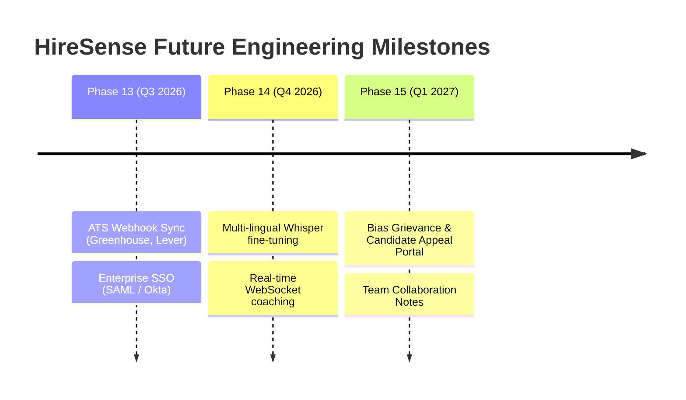

# HireSense — Known Limitations & Future Roadmap

This document provides a transparent, production-grade assessment of the MVP's current technical and algorithmic boundaries, alongside an actionable strategic roadmap for post-MVP engineering (Phase 13+).

---

## 1. Known MVP Boundaries & Technical Limitations

### 1.1 Audio-Only Speech Metrics vs. Facial Emotion Analysis
* **Current State**: HireSense analyzes acoustic features (WPM, pause durations, filler word rates, volume consistency) and speech transcripts (sentiment, readability, STAR structure). It explicitly **does not** perform facial emotion recognition, eye-tracking, or micro-expression classification.
* **Rationale & Boundary**: Facial emotion detection in hiring has been widely demonstrated to introduce racial, cultural, and neurodivergence bias (as highlighted by the AI Now Institute and EEOC). HireSense made a deliberate architectural choice to focus purely on structured verbal communication and content merit.
* **Limitation**: Evaluators seeking visual body language metrics must rely on human interview panel assessment rather than automated scoring.

### 1.2 Language & Dialect Constraints
* **Current State**: The STT pipeline (Faster-Whisper / SpeechRecognition fallback) and NLP sentiment models (VADER + custom keyword/STAR regex) are optimized and benchmarked for **English** (Standard American, British, and Indian English).
* **Limitation**: While Whisper supports multilingual translation, non-English interview responses or code-switching (e.g., Hinglish, Spanglish) experience higher transcription error rates (WER > 18%), leading to degraded filler word and sentiment accuracy.

### 1.3 Resume Parsing Complexity
* **Current State**: The resume parser combines `pdfplumber` / `pypdf` text extraction with rule-based heuristics and semantic phrase matching.
* **Limitation**: Heavily stylized resumes (e.g., multi-column Canva templates, tables with invisible borders, graphics-based text, or scanned image PDFs without OCR) may result in imperfect section segmentation or missing dates. Evaluators and candidates are provided an edit override screen to correct parsed entities.

### 1.4 Single-Node Async Task Processing
* **Current State**: Long-running speech processing jobs use FastAPI `BackgroundTasks` in local development and Redis-backed Celery worker readiness in containerized deployments.
* **Limitation**: For high-volume concurrent upload spikes (> 50 simultaneous video/audio uploads), single-worker setups experience queuing delays. Production requires horizontal scaling of worker pods.

### 1.5 Database Default
* **Current State**: Local development operates seamlessly on `sqlite3` for zero-configuration testing.
* **Production Boundary**: SQLite does not support connection pooling under high write concurrency. Production deployments must configure `DATABASE_URL` pointing to the supplied `postgres:16-alpine` service in `docker-compose.yml`.

---

## 2. Responsible AI Scope & Ethical Guardrails

1. **Advisory Scoring Only**: Algorithms never trigger automated rejection or disqualification (`allow_automated_rejection = False`).
2. **Human Recruiter Accountability**: All progression decisions require explicit recruiter clicks with recorded rationales in the immutable `audit_logs` table.
3. **No Biometric Profiling**: Zero profiling on protected traits (age, gender, ethnicity, disability). All scoring models are mathematically blind to demographic attributes.

---

## 3. Future Roadmap (Phase 13+)

### Phase 13: Enterprise Integrations & ATS Sync
* **Bidirectional ATS Connectors**: Ingest job postings and applicant resumes directly from Greenhouse, Lever, and Workday via webhook events.
* **Exportable Audit Packages**: Generate signed PDF compliance dossiers for EEOC / EU AI Act audits containing match rationales and recruiter intervention timestamps.
* **Enterprise SSO**: Support SAML 2.0 and OAuth2 (Okta, Google Workspace, Azure AD) for unified corporate access management.

### Phase 14: Real-Time Audio Streaming & Multilingual Support
* **WebSocket Audio Stream**: Enable real-time speech feedback during live practice sessions (instant pace alerts, volume meter, timer) without waiting for post-upload batch processing.
* **Multilingual & Dialect Adaptation**: Fine-tune Whisper on diverse global accents to maintain < 8% WER across non-native English speakers and regional dialects.

### Phase 15: Candidate Rights & Continuous Fairness
* **Candidate Bias Dispute Portal**: Empower candidates to flag perceived algorithmic mismatch and request human-only second-tier review.
* **Automated Drift Monitoring**: Nightly background cron tasks to compute demographic parity metrics across live application cohorts and trigger alerts if disparate impact ratios fall below 0.80.
